# Опис проєкту

Цей проєкт є реалізацію бекенд-системи, яка надає користувачам можливість аналізу завантажених фотографій для діагностики різних типів захворювань за допомогою відповідних моделей штучного інтелекту, а також надає адміністратору можливість керування моделями ШІ: додавання нових моделей та нових типів досліджень, керування версіями моделей, активації та деактивації моделей та розгортання розроблених компонентів системи.

# Основна функціональність:

- Адміністратор:
  - Керування моделями для діагностики (додавання нових моделей, нових версій, видалення моделей, блокування доступу до моделей)
  - Керування версіями моделей (додавання нових версій моделей, блокування доступу до моделей)
  - Керування діагностиками - призначення моделей, за допомогою яких виконується певний тип діагностик, додавання нових діагностик, видалення
  - Створення та керування користувачами-пацієнтами<br>
- Пацієнт (користувач):
  - Перегляд доступних методів діагностик
  - Створення запитів на діагностику захворювань за зображенням
  - Перегляд результату діагностики
  - Перегляд історії діагностик та результатів

# Список застосунків/інфраструктури

### Структурна схема застосунків:

Система складається з наступних компонентів:

- API service, який відповідає за обробку запитів користувачів для роботи з системою (забезпечення ACL, доступу до діагностики і т.д.)
- Disease-analyzer service, який відповідає за логіку завантаження конкретної моделі ШІ в пам'ять та виконання діагностики за допомогою цієї моделі для отримання числового результату ймовірності захворювання
- Для комунікації між сервісами було обрано асинхронну чергу повідомлень
- Для збережння даних користувачів, діагностик API сервіс взаємодії з базою даних
- Для збереження файлів для діагностики та для збереження файлів моделей, API сервер буде звертатись до файлового сховища

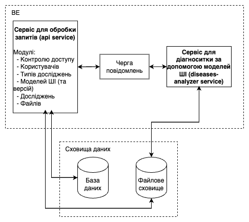

### Розгортання системи в Docker

Розгортання всіх компонентів системи виконується в Docker
Для зручності розгортання був реалізований [docker-compose файл](./docker-compose.yml), у якому описані всі компоненти системи (API-сервіс, сервіс діагностування, образ PostgreSQL, Minio (файлове сховище))

Діаграма розгортання системи в Docker:

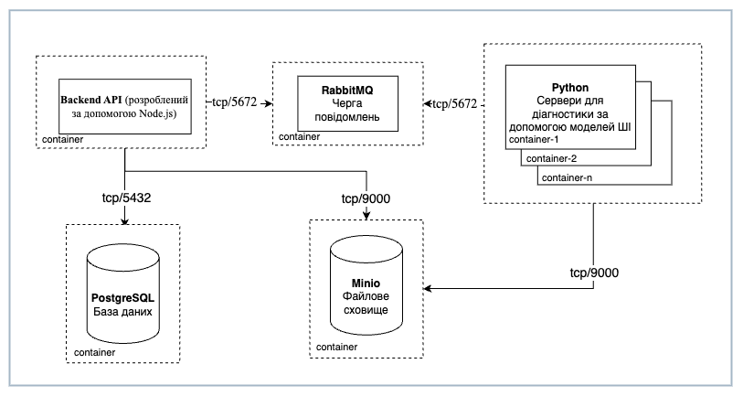

Розгортання контейнерів застосунку для діагностування за допомогою моделей ШІ виконується CRON джобою в API-сервісі за допомогою звернень до Docker API, оскільки моделі та їхні версії можуть редагуватись адміністратором, при видаленні моделі виконується вимкнення та видалення відповідного контейнеру, а для додавання нових моделей/версій, крон джоба перевіряє наявність нових моделей і виконує запити для підняття контейнеру з відповідними моделями.

# Встановлення та запуск проєкту

1. Клонування репозиторію:

```sh
git clone https://github.com/KhrapkoVasyl/preliminary-diagnosis-backend.git
```

Перейдіть у директорію проєкту:

```sh
cd preliminary-diagnosis-backend
```

2. Запуск контейнерів системи за допомогою docker-compose:

   ```sh
   docker-compose up
   ```

Даний скрипт запускає сервіси системи в **production** конфігурації

3. Конфігурація системи (опціонально):
   Для зручного налаштування системи були створені `.env` файли для сервісів **А** та **Б**. Ці файли містять усі необхідні змінні оточення для коректної роботи сервісів.

### Шляхи до `.env.production` файлів:

- [api service](./services/api/.env.production)
- [diseases-analyzers service](./services/diseases-analyzers/.env.production)

4. Відкрийте http://127.0.0.1:8080 для перегляду Swagger документації доступних ендпоінтів API сервісу
   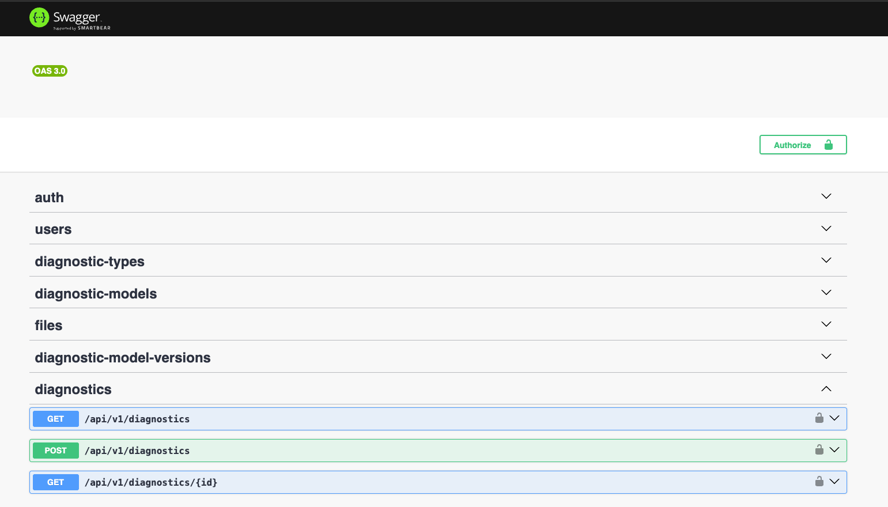

# Приклади використання програми

Для входу з акаунту адміністратора можна використовувати наступні дані:

```json
{
  "password": "Pass1234",
  "email": "admin@gmail.com"
}
```

## Один зі сценаріїв використання системи:

### 1. Логін адміністратора

Адміністратор входить у систему за допомогою облікових даних.  
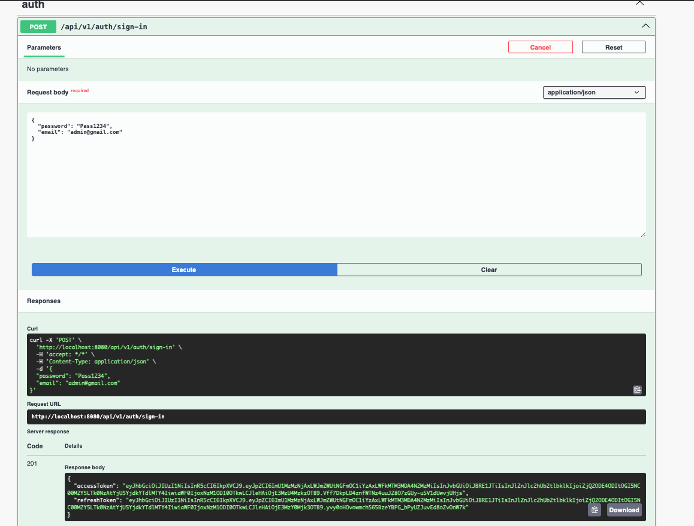

---

### 2. Створення пацієнтів

Після входу адміністратор може створювати нових пацієнтів та надавати їм доступ до системи.  
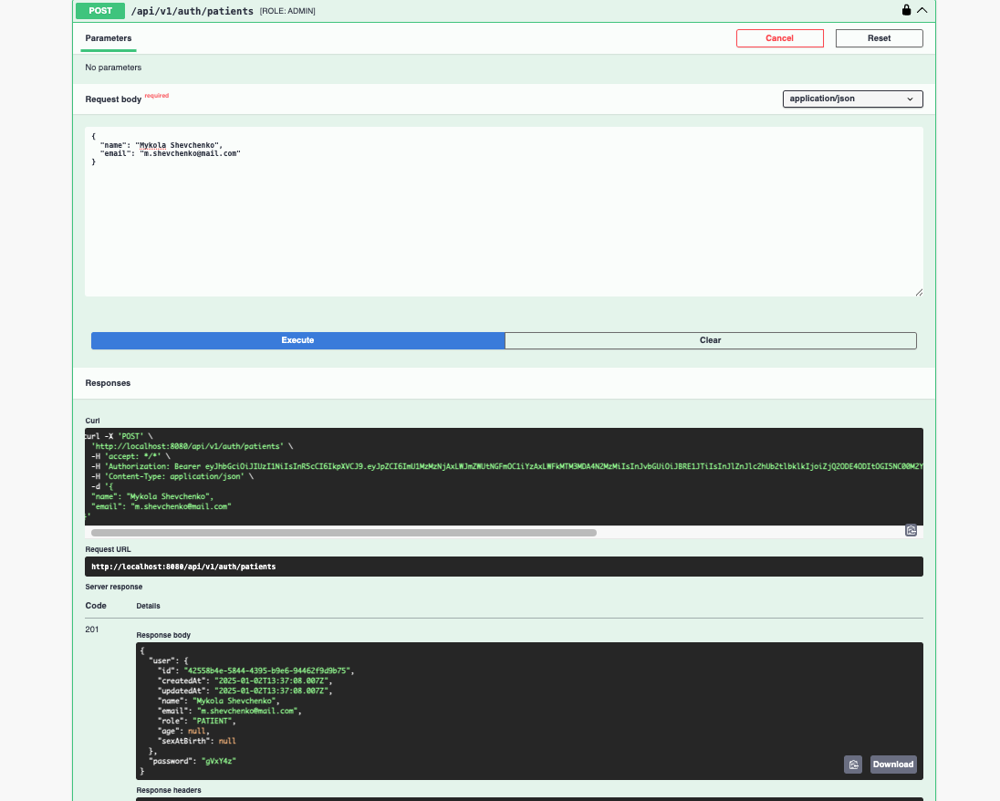

---

### 3. Завантаження нової моделі

Адміністратор завантажує нову модель, яка буде використовуватися для діагностики.  
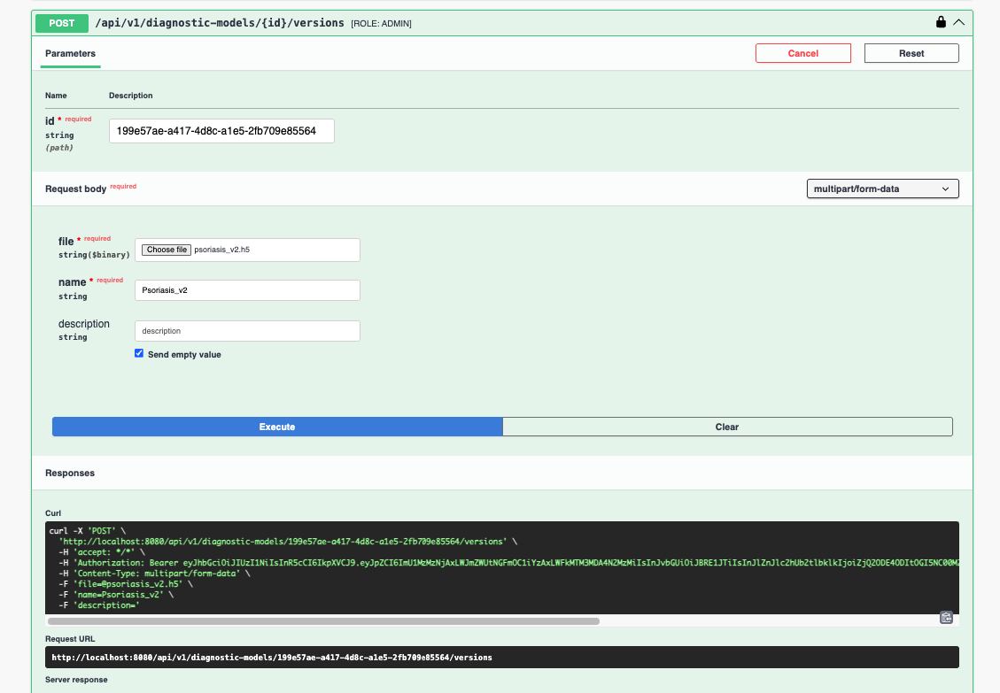

---

### 4. Результат завантаження

Після успішного завантаження нової моделі результати відображаються в Swagger.  
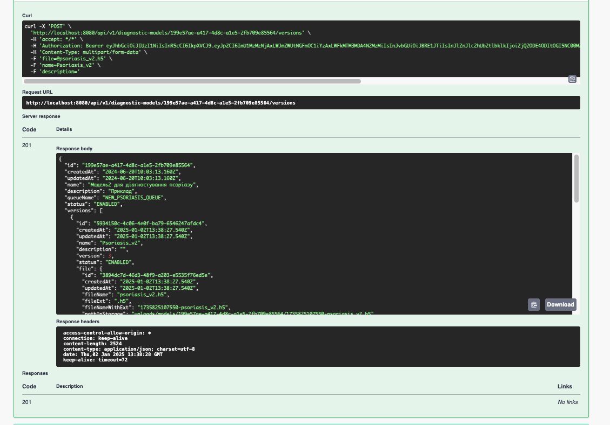

---

### 5. Оновлення контейнера з моделлю

Після завантаження нової моделі піднімається контейнер із новою версією, а контейнер з попередньою версією зупиняється.  
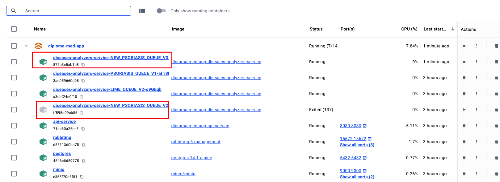

---

### 6. Виконання діагностики

Користувач виконує діагностику, завантажуючи фотографію шкіри для аналізу за допомогою нової моделі.  
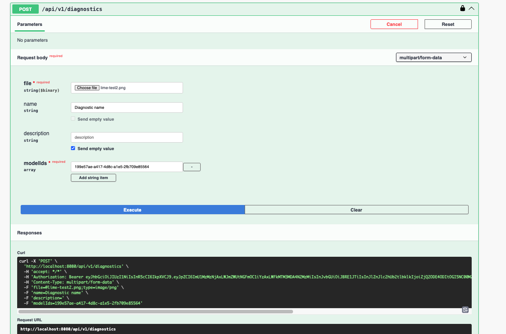

---

### 7. Асинхронна обробка

Результати діагностики обробляються асинхронно. У цей час користувач може продовжувати використовувати систему для інших запитів.  
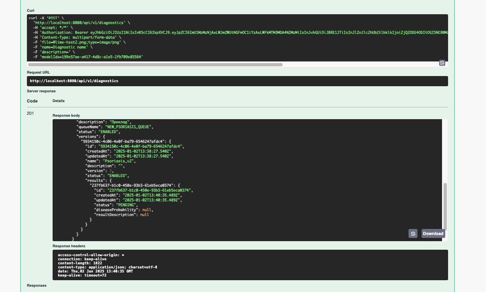

---

### 8. Отримання результату

Після завершення обробки користувач отримує результат аналізу, числове значення ймовірності захворювання, визначення за допомогою обраної моделі ШІ.  
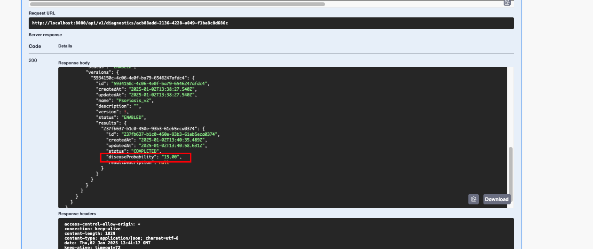

# Розробники

- Храпко Василь <br>
  (khrapko2002@gmail.com, https://github.com/KhrapkoVasyl) <br>

# Приклад файлів моделей діагностики захворювань для тестів

Приклад файлів моделей для діагностування хвороби Лайма та псоріазу на Google Drive за [посиланням](https://drive.google.com/drive/folders/14ukxHgfACpv9PqyXL7VfTAum7O4rFfMU?usp=sharing).
